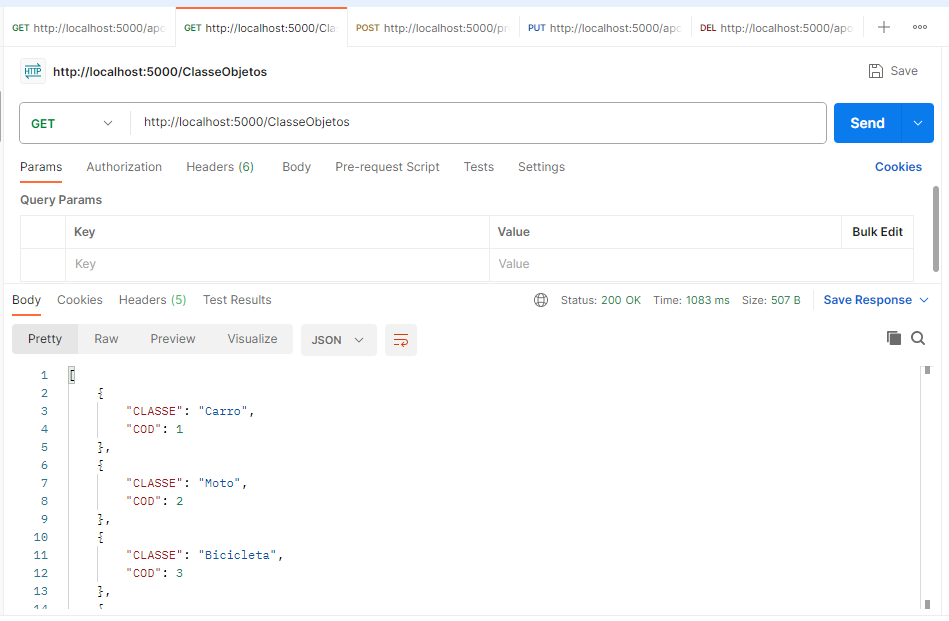
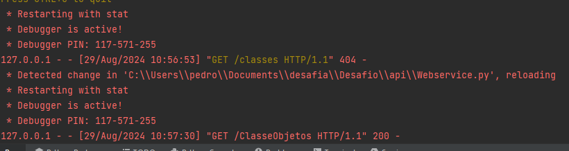
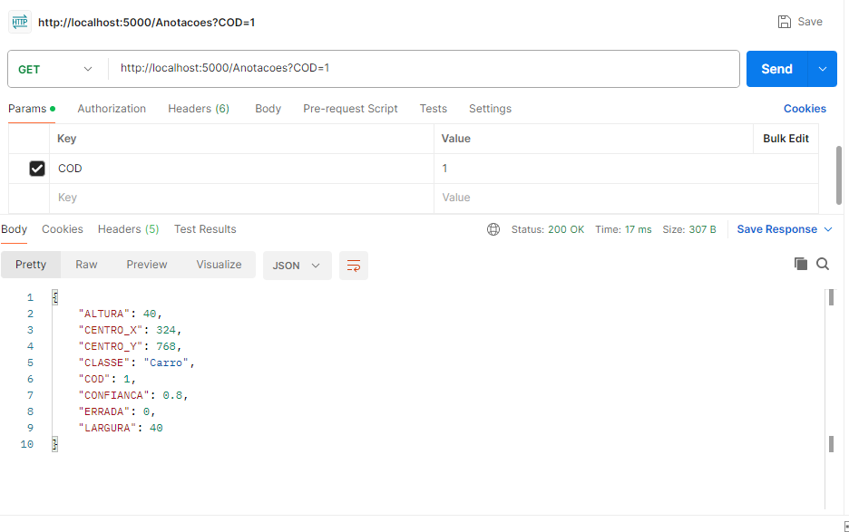
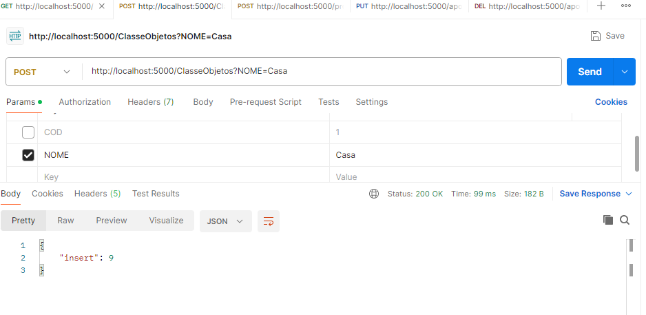
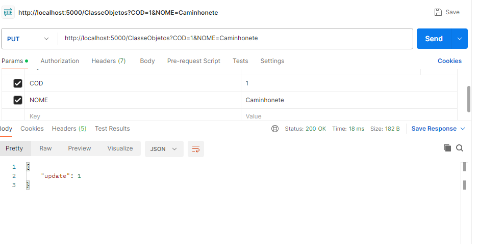
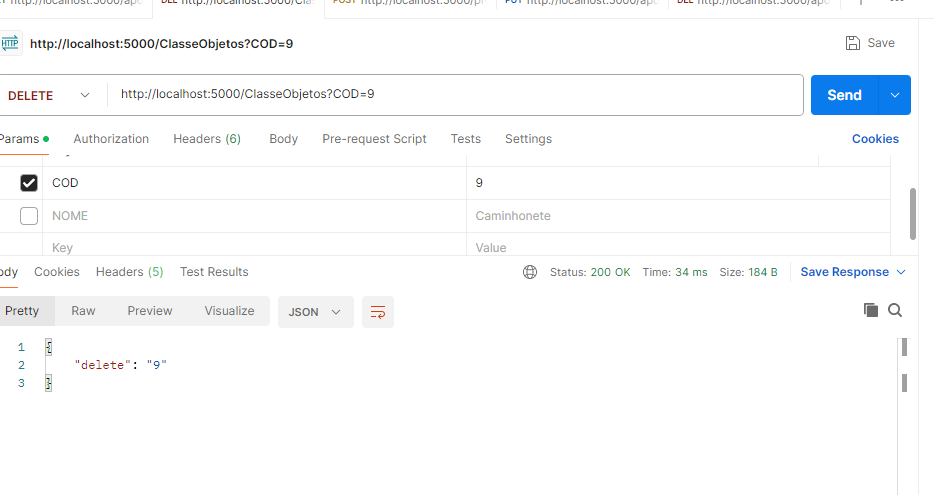

## Desafio técnico de API REST
Neste projeto, criarei uma API REST usando majoritariamente Python e MySQL para criar uma API REST que armazena dados de anotações em imagens.

A API foi desenvolvida usando Flask, JSONIFY e SQLAlchemy como o ORM.

Em cada módulo Python temos seu próprio arquivo de teste unitário, alguns os quais serão posteriormente deletados
para melhorar a legibilidade, pois não servem a muito mais funções além de testar a alocação e 
instanciamento de determinado recurso; O projeto também tem partes do código onde foi usada uma ferramenta muito prática do 
Python chamada programação reflexiva, que pode ser meio confusa aos leitores que nunca viram,
mas abrevia muito a criação de código e creio estar bem explicada em comentários.

Após a criação da API estou dando seguimento aos testes no Postman, e o primeiro caso está OK.

Foi efetuado o primeiro teste a uma requisição GET apenas para testar a resposta do servidor do Flask
com os seguintes resultados:

Note que a API devolve um JSON com as classes de veículos, 
e aqui temos a imagem do servidor Flask recebendo a requisição:

Testada também a situação onde queremos acessar uma única anotacao:

Alguns memlhoramentos ainda podem ser feitos, como máscaras para
visualização do resultado de anotações como booleanos e uma função
de pesquisa por anotações erradas. Tudo 
isso será implementado em breve, porém todas as funções foram aprovadas nos testes.

Seguem as telas de resposta para outras chamadas HTTP, apenas como exemplo:

Para o POST é feita a inserção de um objeto novo no banco e a API retorna a sua chave primária gerada.

Para o PUT é feita a alteração de um registro no banco e dessa vez ele retorna a chave primária que o identifica, ou 0 para avisar
que o objeto não foi encontrado

E no caso de um DELETE a API retorna a chave primária do objeto deletado ou 0 
caso não o encontre

O funcionamento é análogo para a Anotação, porém o JSON é mais verboso.